<h3><code>mrj@github ~ $ whoami</code></h3>

<table>
<tr>
<td valign="top"></td>
<td valign="top"></td>
</tr>
</table>

AI Engineer &amp; Software Developer, based in Germany. 
I build voice agents, automations, and AI products, then ship them for real.

 

<h3><code>mrj@github ~ $ ./stack.sh</code></h3>

 

<h3><code>mrj@github ~ $ ./contributions.sh</code></h3>

 

<h3><code>mrj@github ~ $ ls featured-projects/</code></h3>

<table>
<tr>
<td width="50%" valign="top">

**[synctrack_customer_voice_agent](https://github.com/MrJohn91/synctrack_customer_voice_agent)**
Voice AI agent that talks to website visitors in real time, explains the business, and captures qualified leads straight into a CRM, running on a cloned voice.

</td>
<td width="50%" valign="top">

**[medlive_AI](https://github.com/MrJohn91/medlive_AI)**
AI triage assistant for healthcare that sees, listens, and guides patients to the right care, built to cut wait times.

</td>
</tr>
<tr>
<td width="50%" valign="top">

**[portfolio-website](https://github.com/MrJohn91/portfolio-website)**
My own AI-powered portfolio site with a voice-enabled agent, Gemini, Notion as a CMS, and live GitHub integration.

</td>
<td width="50%" valign="top">

**[Snowflake MCP Server + Kiro CLI](https://github.com/MrJohn91/Snowflake-MCP-Server-with-Kiro-CLI-Integration)**
Custom MCP server that lets Kiro CLI query and visualize Snowflake data using plain natural language.

</td>
</tr>
<tr>
<td width="50%" valign="top">

**[univacity_mcp](https://github.com/MrJohn91/univacity_mcp)**
MCP server for intelligent education program recommendations, with local MCP support plus a cloud-deployed API behind GitHub OAuth.

</td>
<td width="50%" valign="top">

**[Outreach Scraping Toolkit](https://github.com/MrJohn91/Outreach-Scraping-Preparation-Toolkit)**
Web tool for scraping and managing outreach leads across multiple platforms, with a working dashboard.

</td>
</tr>
</table>

 

<h3><code>mrj@github ~ $ ./links.sh</code></h3>

